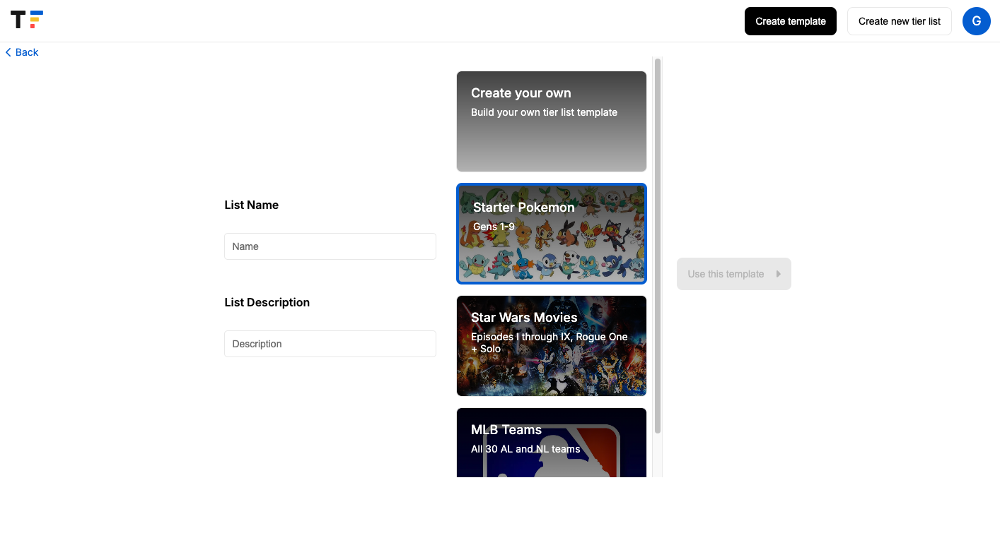

# 
Tierforge is a tierlist building app where users can organize and share their own tierlists from existing templates or create their own templates. 

[Live demo link](https://tierforge.onrender.com/)

## 💻 Technologies used
<div>
   
   
   &nbsp;
   &nbsp;
   &nbsp;
   &nbsp;
   &nbsp;
   &nbsp;
   &nbsp;
   
</div>

## ⚙️ Getting started

1. Clone this repository.

2. Install dependencies.

   ```bash
   pipenv install -r requirements.txt
   ```

3. Create a __.env__ file in the root directory and a __.env.local__ file in the ```tierlist``` based on the example with proper settings for your
   development environment.

4. Make sure the SQL database connection DATABASE_URL and django's SECRET_KEY is in the __.env__ file, ensure that NEXT_PUBLIC_BACKEND_URL is in the __.env.local__ file.

5. To setup and run the Django app:

    ```bash
   cd backend
   ```


   ```bash
   python manage.py makemigrations
   ```

   ```bash
   python manage.py migrate
   ```

   ```bash
   python manage.py loadddata seed
   ```

   ```bash
   python manage.py runserver
   ```

   The backend will run on port 8000 by default.

6. To run the Next.js frontend in development, open a new terminal instance and `cd` into the ```tierlist```
   directory and run `npm i` to install dependencies. Finally, run `npm run dev` to launch the frontend in your local browser (default port 3000).

   ## 🖼️ Application screenshots

   ### Landing Page
   
   From this page, a user may log in, sign up, or automatically log in as a demo user.

   ### Dashboard
   
   Here, a user can view all available tierlist templates, as well as all published tierlists. Clicking on a template will direct the user to a tierlist creation page(with that template pre-selected). Clicking on a published tierlist will take the user to that tierlist. The preview for each published list shows the distribution of items in each tier S (purple) through F (red).

   ### Create Template
   
   On this page, users can add a name, description, background image for a new template. Once the user has done so, they can add individual items to be tiered.

   ### Select Template
   
   Here, the user can select a template to use from a list of all available templates. Creating a tierlist will take a user to that new tierlist, with no items yet tiered and the tierlist will be visible to all users from the dashboard.


    ### Tierlist Page
   
   On this page, the user can view the distribution of items in a tierlist, drag and drop items into other tierlists (using Atlassian's react-beautiful-dnd package), download a screenshot of the tierlist, and (if they are the owner of the tierlist) save changes. 


## 📅 Future features
* Template editing
* Public/Private tierlists